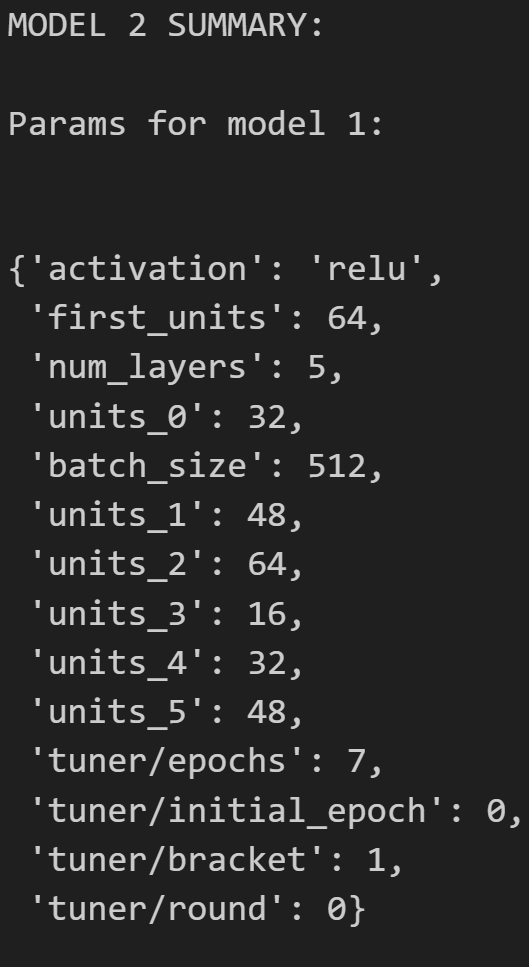

# Deep Learning Challenge
## Purpose
- To be able to achieve 75% accuracy using machine learning through tensorflow and keras
## Data Preprocessing
### What variable(s) are the target(s) for your model?
- ["IS_SUCCESSFUL"] column is the target
### What variable(s) are the features for your model?
- X = dummy_df.drop(columns=["IS_SUCCESSFUL"]).values 
### What variable(s) should be removed from the input data because they are neither targets nor features?
- ["EIN", "NAME"] columns should be dropped
## Compiling, Training, and Evaluating the Model
### How many neurons, layers, and activation functions did you select for your neural network model, and why?
- The solution I implemented uses keras-tuner. The neurons, layers and activations will be dynamically chosen  by keras auto-tuner as manually adding neurons/layers wasn't yielding results. Changing activations also didn't achieve the target score. The best neural network model will be dependent on the run itself as keras-tuner will determine the best automatically. Key observations from my manual tuning however indicates minimal improvements when adding layers and neurons as also reflected by keras-tuner not achieving the desired 75% target accuracy which may indicate overfitting. The dataset may be more suitable for other models instead of using keras Sequential. 3 models was defined using tuner.get_best_models(3) with their 3 parameters using tuner.get_best_hyperparameters(3).

Model 1:

Model 2:

Model 3:

### Were you able to achieve the target model performance?
- No. Neither manually tuning nor using keras-tuner achieved 75% accuracy. The best model only achieved 73.56% as shown by the snippet below:

### What steps did you take in your attempts to increase model performance?
- Adding layers, adding neurons and trying different activations: tanh, relu, and sigmoid.
- Defining a keras-tuner as shown below:

## Summary
- In conclusion, manually adding layers and neurons yielded minimal improvements which suggest an overfitting issue. The same can be said for using other activations like tanh. Using keras-tuner to automatically define the best layers also failed to achieve the target accuracy. Dataset might be more suitable for other machine learning models other than the keras Sequential model. 

## Other models to consider
- Instead of using the keras Sequential() model, using the Random Forest Classifier model instead might yield better result. It follows the same concept as before: pre process data by dropping unrelated columns, scaling the data and then fitting the data with the model.